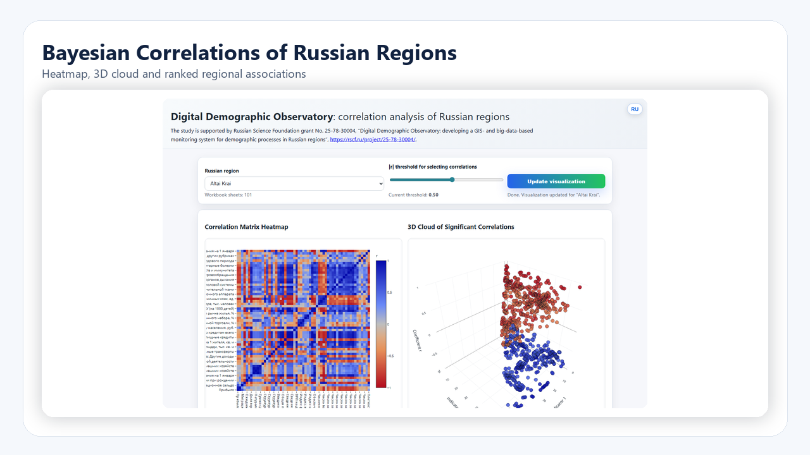
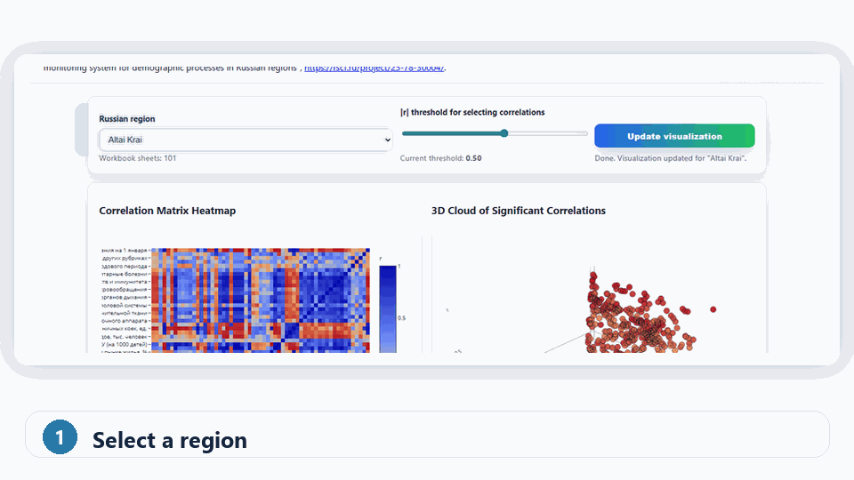
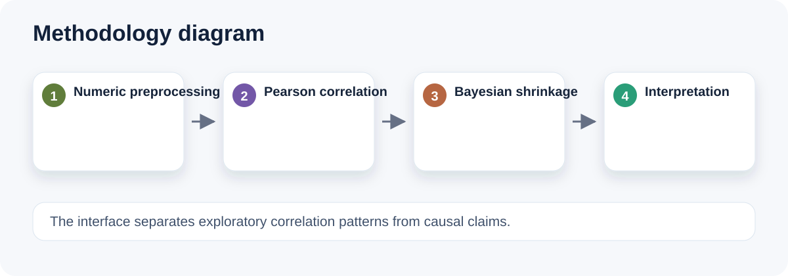
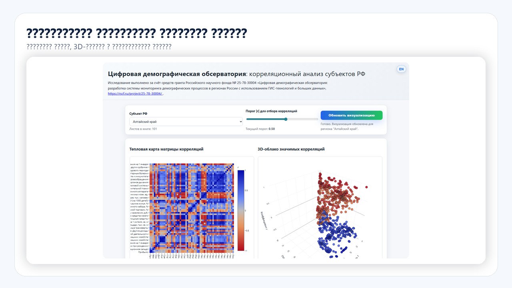
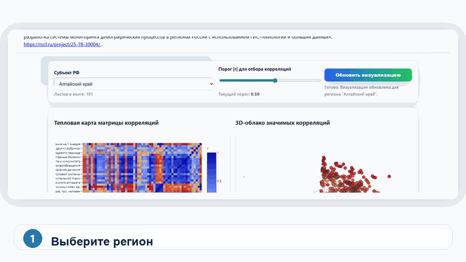

# Bayesian Correlations of Russian Regions · Digital Demographic Observatory

[English](#english) · [Русский](#русский)

[](https://arseniy24rus.github.io/Bayes-correlations-of-Russia/)
[](LICENSE)
[](https://creativecommons.org/licenses/by/4.0/)

---

## English

### Overview

`Bayes-correlations-of-Russia` is an interactive digital demographic observatory for correlation analysis across Russian regions. It combines statistical preprocessing, Pearson correlation matrices, empirical Bayesian shrinkage and web-based visualization for exploring relationships among socio-demographic indicators.

The project is designed as a hypothesis-generating instrument. It helps researchers and students identify robust associations, compare regional patterns and inspect statistically meaningful relationships, while keeping the methodological limitations of correlation analysis explicit.

### Research context

The dashboard is associated with the research agenda of a digital demographic observatory using GIS technologies and large-scale data. It is suitable for exploratory regional analysis, teaching statistical reasoning and preparing more formal research questions.

### Live dashboard

GitHub Pages: <https://arseniy24rus.github.io/Bayes-correlations-of-Russia/>

### Visual overview








### Repository structure

```text
corr.py                                      Script for correlation matrix calculation
interactive_3d_analysis.py                   Auxiliary script for 3D correlation analysis
corr_all_regions_all.xlsx                    Generated workbook with regional correlation results
Итоговая_база_для_корреляционного_анализа.xlsx  Input analytical table
index.html                                   Static interactive dashboard
README.md                                    Project documentation
```

### Methodology

The input table is interpreted as a region-year panel: each row corresponds to a territorial unit and year, while columns contain demographic, social and economic indicators. The workflow includes filtering of non-regional aggregate rows, treatment of region and year identifiers, removal of duplicate rows, selection of numeric indicators and exclusion of variables with insufficient variation or excessive missingness.

The main analytical layer is based on Pearson correlations. To reduce instability for short time series, the project applies empirical Bayesian shrinkage to correlation coefficients. A simplified form of the shrinkage logic is:

```text
r_bayes = r * (1 - (1 - r²) / (n - 2))
```

where `r` is the Pearson correlation coefficient and `n` is the number of valid observations for a pair of indicators. This adjustment does not transform correlations into causal estimates; it only makes small-sample coefficients more conservative.

### Dashboard features

The interactive dashboard includes a heatmap of correlations, a 3D visualization of significant relationships, ranked lists of strongest positive and negative associations, and explanatory text for interpreting the results. It is intended to make regional correlation structures easier to inspect visually.

### How to reproduce

A typical local workflow is:

```bash
# Optional: create a virtual environment
python -m venv .venv
source .venv/bin/activate  # Windows: .venv\Scripts\activate

# Install required packages as needed
python -m pip install pandas numpy openpyxl plotly

# Rebuild correlation workbook
python corr.py

# Run auxiliary 3D analysis if needed
python interactive_3d_analysis.py

# Serve the dashboard locally
python -m http.server 8000
```

Then open <http://localhost:8000/>.

### Interpretation and limitations

The dashboard reveals associations, not causality. Correlations may be influenced by common trends, data gaps, indicator definitions, regional heterogeneity, administrative boundary changes and the length of available time series. Results should be used as a guide for further substantive and econometric analysis rather than as final evidence of causal mechanisms.

### Citation

If you use the dashboard, scripts, workbook structure or methodological description, please cite:

> Sitkovskiy, A. M. (2026). Bayesian Correlations of Russian Regions: digital demographic observatory. GitHub. https://github.com/Arseniy24RUS/Bayes-correlations-of-Russia

### License

Unless otherwise stated, source code is released under the MIT License. Data, documentation and dashboard text are released under Creative Commons Attribution 4.0 International (CC BY 4.0). External source data may be governed by the terms of their original providers.

---

## Русский

### Обзор

`Bayes-correlations-of-Russia` — интерактивная цифровая демографическая обсерватория для корреляционного анализа субъектов Российской Федерации. Проект объединяет статистическую предобработку, матрицы корреляций Пирсона, эмпирическую байесовскую стабилизацию коэффициентов и веб-визуализацию связей между социально-демографическими показателями.

Проект задуман как инструмент генерации исследовательских гипотез. Он помогает исследователям и студентам выявлять устойчивые ассоциации, сравнивать региональные паттерны и изучать статистически значимые связи, сохраняя явное описание ограничений корреляционного анализа.

### Исследовательский контекст

Дашборд связан с исследовательской повесткой цифровой демографической обсерватории, использующей ГИС-технологии и большие данные. Он подходит для разведочного регионального анализа, преподавания статистического мышления и подготовки более строгих исследовательских вопросов.

### Публичный дашборд

GitHub Pages: <https://arseniy24rus.github.io/Bayes-correlations-of-Russia/>

### Визуальный обзор






### Структура репозитория

```text
corr.py                                      Скрипт расчёта корреляционных матриц
interactive_3d_analysis.py                   Вспомогательный скрипт 3D-анализа корреляций
corr_all_regions_all.xlsx                    Сформированная книга с региональными результатами
Итоговая_база_для_корреляционного_анализа.xlsx  Входная аналитическая таблица
index.html                                   Статический интерактивный дашборд
README.md                                    Документация проекта
```

### Методология

Входная таблица рассматривается как панель «регион — год»: каждая строка соответствует территориальной единице и году, а столбцы содержат демографические, социальные и экономические показатели. Рабочий процесс включает фильтрацию нерегиональных агрегатов, обработку идентификаторов региона и года, удаление дублей, выбор числовых показателей и исключение переменных с недостаточной вариативностью или чрезмерным количеством пропусков.

Основной аналитический слой основан на корреляциях Пирсона. Чтобы снизить нестабильность оценок для коротких временных рядов, проект применяет эмпирическую байесовскую стабилизацию коэффициентов. Упрощённая логика корректировки:

```text
r_bayes = r * (1 - (1 - r²) / (n - 2))
```

где `r` — коэффициент корреляции Пирсона, а `n` — число валидных наблюдений для пары показателей. Эта корректировка не превращает корреляции в причинные оценки; она лишь делает коэффициенты при малом числе наблюдений более консервативными.

### Возможности дашборда

Интерактивный дашборд включает тепловую карту корреляций, 3D-визуализацию значимых связей, ранжированные списки наиболее сильных положительных и отрицательных ассоциаций и пояснительный текст для интерпретации результатов. Его задача — сделать региональные корреляционные структуры более доступными для визуального анализа.

### Как воспроизвести

Типовой локальный процесс:

```bash
# Опционально: создать виртуальное окружение
python -m venv .venv
source .venv/bin/activate  # Windows: .venv\Scripts\activate

# Установить необходимые пакеты
python -m pip install pandas numpy openpyxl plotly

# Пересобрать книгу корреляций
python corr.py

# Запустить вспомогательный 3D-анализ при необходимости
python interactive_3d_analysis.py

# Запустить локальный сервер для дашборда
python -m http.server 8000
```

Затем откройте <http://localhost:8000/>.

### Интерпретация и ограничения

Дашборд показывает ассоциации, а не причинно-следственные связи. Корреляции могут зависеть от общих трендов, пропусков в данных, определения показателей, региональной неоднородности, изменений административных границ и длины доступных временных рядов. Результаты следует использовать как основание для дальнейшего содержательного и эконометрического анализа, а не как окончательное доказательство причинных механизмов.

### Как цитировать

При использовании дашборда, скриптов, структуры рабочей книги или методологического описания, пожалуйста, цитируйте:

> Ситковский А. М. Bayesian Correlations of Russian Regions: digital demographic observatory. GitHub, 2026. https://github.com/Arseniy24RUS/Bayes-correlations-of-Russia

### Лицензия

Если явно не указано иное, исходный код распространяется по лицензии MIT. Данные, документация и тексты дашборда распространяются по лицензии Creative Commons Attribution 4.0 International (CC BY 4.0). Внешние исходные данные могут регулироваться условиями их первоначальных поставщиков.
